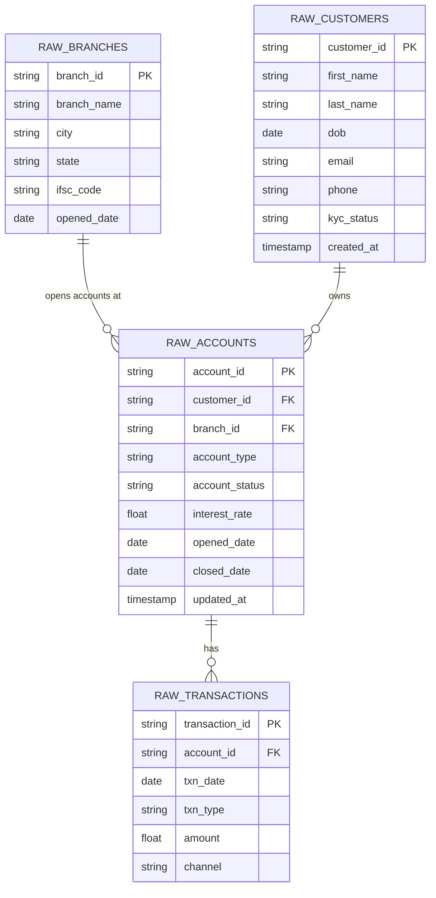
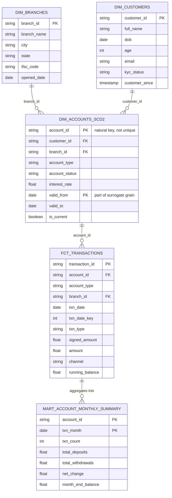

# Data Model — Bank Savings Account Pipeline

This project models a retail bank's savings account business end-to-end:
raw operational extracts → staging → intermediate → dimensional mart, with
full SCD Type 2 history on accounts and an incremental fact table for
transactions.

## 1. Grain summary

| Layer | Object | Grain | Type |
|---|---|---|---|
| Raw | `RAW_BRANCHES` | 1 row per branch | Source table |
| Raw | `RAW_CUSTOMERS` | 1 row per customer | Source table |
| Raw | `RAW_ACCOUNTS` | 1 row per account per load (day1/day2) | Source table |
| Raw | `RAW_TRANSACTIONS` | 1 row per transaction per batch | Source table |
| Mart | `dim_branches` | 1 row per branch | Dimension |
| Mart | `dim_customers` | 1 row per customer | Dimension |
| Mart | `dim_accounts_scd2` | 1 row per account per version (SCD2) | Dimension, Type 2 |
| Mart | `fct_transactions` | 1 row per transaction | Incremental fact |
| Mart | `mart_account_monthly_summary` | 1 row per account per month | Aggregate mart |

## 2. Raw / Source ER diagram



## 3. Mart layer ER diagram (dimensional model)

`fct_transactions` is the fact table. `dim_accounts_scd2` is Type 2
(multiple versions per `account_id`), everything else is Type 1.



## 4. Why `dim_accounts_scd2` isn't a simple 1:1 join

`account_id` is **not unique** in `dim_accounts_scd2` — the true grain is
`(account_id, valid_from)`. This is intentional: it's what lets you answer
"what was this account's interest rate or status as of 15 March?" by
filtering `valid_from <= '2026-03-15' and (valid_to > '2026-03-15' or
valid_to is null)`, rather than only ever seeing today's value.

`fct_transactions`, by contrast, joins to `stg_accounts` (the current-state
staging view) for `account_type`/`branch_id`, not to the SCD2 dimension —
this keeps the incremental fact simple and avoids a fan-out join against a
Type 2 table. If you needed "account type *as of the transaction date*"
instead of "account type today," you'd join `fct_transactions.txn_date`
between `dim_accounts_scd2.valid_from` and `valid_to` instead. Worth
mentioning in an interview if asked how you'd extend this.

## 5. Lineage (source → mart)

```
RAW_BRANCHES  ────────► stg_branches  ────────────────────► dim_branches
RAW_CUSTOMERS ────────► stg_customers ────────────────────► dim_customers
RAW_ACCOUNTS  ─┬──────► stg_accounts  ─┬─► int_accounts_enriched
               │                       │
               └──► accounts_snapshot (SCD2) ──► dim_accounts_scd2
RAW_TRANSACTIONS ─────► stg_transactions ──► int_transactions_with_balance ──► fct_transactions ──► mart_account_monthly_summary
```

See `models/staging/_sources.yml`, `models/marts/_marts_models.yml`, and
`snapshots/accounts_snapshot.sql` for the exact ref/source definitions this
diagram is generated from. Running `dbt docs generate && dbt docs serve`
gives you the interactive, auto-generated version of this same lineage
graph — worth demoing live if asked in an interview.

